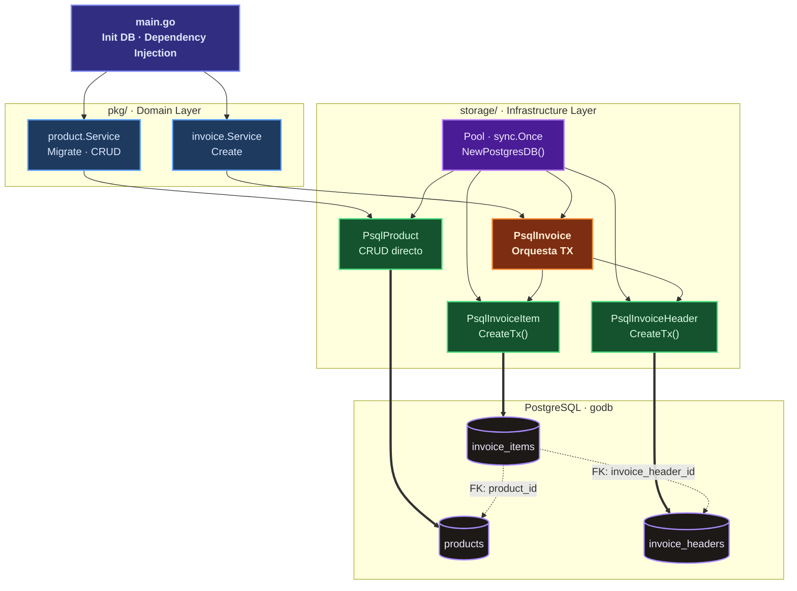
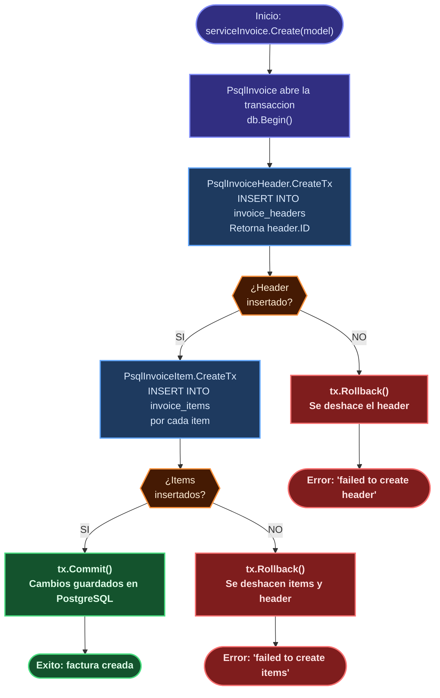

# Architecture Diagrams

---

## 1. Arquitectura en Capas

Este diagrama muestra cómo está organizado el proyecto en **4 capas** que fluyen de arriba hacia abajo:

| Capa | Carpeta | Responsabilidad |
|------|---------|-----------------|
| **Entry Point** | `main.go` | Inicializa la DB e inyecta dependencias |
| **Domain Layer** | `pkg/` | Contiene la lógica de negocio (servicios) y los contratos (interfaces) |
| **Infrastructure Layer** | `storage/` | Implementa los contratos conectándose a PostgreSQL |
| **Base de Datos** | PostgreSQL | Almacena los datos en 3 tablas relacionadas |

**Cómo leer las flechas:**
- `→` flecha sólida: una capa llama a otra directamente
- `⇒` flecha gruesa: escritura de datos en la base de datos
- `··→` flecha punteada: relación de clave foránea (FK) entre tablas

**Colores:**
- 🟣 Violeta oscuro: `main.go` (punto de entrada)
- 🔵 Azul: Servicios del dominio (`pkg/`)
- 🟢 Verde: Implementaciones de storage CRUD simples
- 🟠 Naranja: `PsqlInvoice` — orquesta la transacción atómica
- 💜 Lila: Singleton de conexión a la DB (`sync.Once`)
- ⬛ Gris oscuro: Tablas de PostgreSQL

---

## 2. Flujo de Transaccion Atomica

Cuando se crea una factura, el sistema debe insertar datos en **dos tablas distintas** dentro de una sola transacción. Esto garantiza que nunca quede una cabecera sin sus ítems (o viceversa) ante un error.

El diagrama muestra cada paso del proceso y qué ocurre si algo falla:
- **Camino verde** (`→`): todo salió bien → `COMMIT`, los datos quedan guardados
- **Camino rojo** (`→`): algo falló → `ROLLBACK`, se deshacen **todos** los cambios

